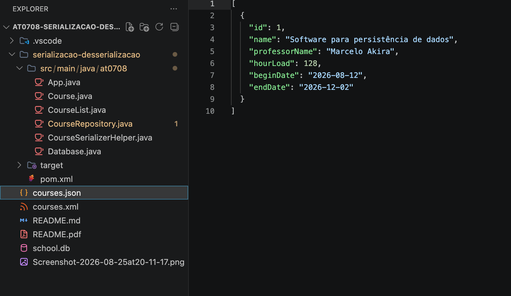
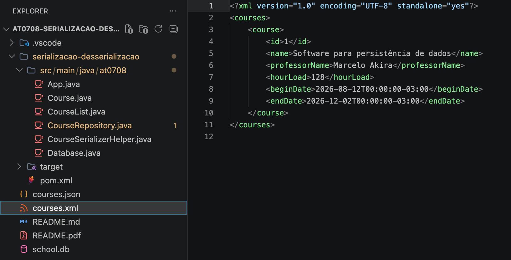

# AT0708 - Serialização e desserialização de objetos
Aluno: João Victor Lemes Faria - 202302614

### Entidade utilizada

```java
@XmlRootElement(name = "course")
@XmlAccessorType(XmlAccessType.FIELD)
public class Course {
    public Course() {
        super();
    }

    public Course(
            String name,
            String professorName,
            int hourLoad,
            Date beginDate,
            Date endDate) {
        this.name = name;
        this.professorName = professorName;
        this.hourLoad = hourLoad;
        this.beginDate = beginDate;
        this.endDate = endDate;
    }

    @DatabaseField(generatedId = true)
    private int id;

    @DatabaseField
    private String name;

    @DatabaseField
    private String professorName;

    @DatabaseField
    public int hourLoad;

    @DatabaseField(dataType = DataType.DATE)
    public Date beginDate;

    @DatabaseField(dataType = DataType.DATE)
    public Date endDate;

    // Getters e setters omitidos no documento

    @Override
    public String toString() {
        return "Course [id=" + id + ", name=" + name + ", professorName=" + professorName + ", hourLoad=" + hourLoad
                + ", beginDate=" + beginDate + ", endDate=" + endDate + "]";
    }
}

```

### Classe de repositório

```java
public class CourseRepository {
    private static Database database;
    private static Dao<Course, Integer> dao;
    private List<Course> loadedCourses;
    private Course loadedCourse;
    private CourseSerializerHelper serializerHelper;

    public CourseRepository(Database database, CourseSerializerHelper courseSerializerHelper) {
        CourseRepository
            .setDatabase(database);
        this.serializerHelper = courseSerializerHelper;
        loadedCourses = new ArrayList<Course>();
    }

    public static void setDatabase(Database database) {
        CourseRepository.database = database;
        try {
            dao = DaoManager.createDao(database.getConnection(), Course.class);
            TableUtils.createTableIfNotExists(database.getConnection(), Course.class);
        } catch (SQLException e) {
            System.out.println(e);
        }
    }

    public Course create(Course Course) {
        int nrows = 0;
        try {
            nrows = dao.create(Course);
            if ( nrows == 0 )
                throw new SQLException("Error: object not saved");
            this.loadedCourse = Course;
            loadedCourses.add(Course);
        } catch (SQLException e) {
            System.out.println(e);
        }
        return Course;
    }

    public Course update(Course Course) {
        int nrows = 0;
        try {
            nrows = dao.update(Course);
            if ( nrows == 0 )
                throw new SQLException("Error: object not updated");
            this.loadedCourse = Course;
        } catch (SQLException e) {
            System.out.println(e);
        }
        return Course;
    }

    public void delete(Course Course) {
        int nrows = 0;
        try {
            nrows = dao.delete(Course);
            if ( nrows == 0 )
                throw new SQLException("Error: object not deleted");
            loadedCourses.remove(Course);
        } catch (SQLException e) {
            System.out.println(e);
        }
    }

    public Course loadFromId(int id) {
        try {
            this.loadedCourse = dao.queryForId(id);
            if (this.loadedCourse != null)
                this.loadedCourses.add(this.loadedCourse);
        } catch (SQLException e) {
            System.out.println(e);
        }
        return this.loadedCourse;
    }

    public List<Course> loadAll() {
        try {
            this.loadedCourses = dao.queryForAll();
            if (this.loadedCourses.size() != 0)
                this.loadedCourse = this.loadedCourses.get(0);
        } catch (SQLException e) {
            System.out.println(e);
        }
        return this.loadedCourses;
    }

    public String dumpData(String format) throws JAXBException {
        var allCourses = loadAll();

        if (format.equalsIgnoreCase("json")) {
            return serializerHelper.toJson(allCourses);
        }

        if (format.equalsIgnoreCase("xml")) {
            return serializerHelper.toXml(allCourses);
        }

        return null;
    }

    public boolean dumpFile(String format, File file) {
        try {
            String data = dumpData(format);
            if (data == null) {
                return false;
            }
            try (FileWriter writer = new FileWriter(file)) {
                writer.write(data);
            }
            return true;
        } catch (IOException | JAXBException e) {
            System.out.println(e);
            return false;
        }
    }

    public Course createFromJSON(String json) {
        Course course = serializerHelper.fromJson(json);
        return create(course);
    }

    public Course createFromXML(String xml) throws JAXBException {
        Course course = serializerHelper.fromXml(xml);
        return create(course);
    }

    public int importData(String format, String data) throws JAXBException {
        List<Course> courses;

        if (format.equalsIgnoreCase("json")) {
            courses = serializerHelper.fromJsonList(data);
        } else if (format.equalsIgnoreCase("xml")) {
            courses = serializerHelper.fromXmlList(data);
        } else {
            return 0;
        }

        if (courses == null) {
            return 0;
        }

        int imported = 0;
        for (Course course : courses) {
            course.setId(0);
            if (create(course) != null) {
                imported++;
            }
        }
        return imported;
    }

    public int importFile(String format, File file) throws JAXBException, IOException {
        String data = Files.readString(file.toPath());
        return importData(format, data);
    }
}
```

### Classe helper de serialização

```java
public class CourseSerializerHelper{
  private Gson gson;
  private JAXBContext jaxbContext;

  public CourseSerializerHelper() throws JAXBException {
    gson = new GsonBuilder()
                      .setDateFormat("yyyy-MM-dd")
                      .setPrettyPrinting()
                      .create();

    jaxbContext = JAXBContext.newInstance(Course.class, CourseList.class);
  }

  public String toJson(Course course){
    return gson.toJson(course);
  }

  public String toJson(List<Course> courses){
    return gson.toJson(courses);
  }

  public Course fromJson(String json){
    return gson.fromJson(json, Course.class);
  }

  public List<Course> fromJsonList(String json){
    Type listType = new TypeToken<ArrayList<Course>>(){}.getType();
    return gson.fromJson(json, listType);
  }

  public String toXml(Course course) throws JAXBException {
    Marshaller marshaller = jaxbContext.createMarshaller();
    marshaller.setProperty(Marshaller.JAXB_FORMATTED_OUTPUT, Boolean.TRUE);
    StringWriter sw = new StringWriter();
    marshaller.marshal(course, sw);
    return sw.toString();
  }

  public String toXml(List<Course> courses) throws JAXBException {
    Marshaller marshaller = jaxbContext.createMarshaller();
    marshaller.setProperty(Marshaller.JAXB_FORMATTED_OUTPUT, Boolean.TRUE);
    StringWriter sw = new StringWriter();
    marshaller.marshal(new CourseList(courses), sw);
    return sw.toString();
  }

  public Course fromXml(String xml) throws JAXBException {
    Unmarshaller unmarshaller = jaxbContext.createUnmarshaller();
    StringReader sr = new StringReader(xml);
    return (Course) unmarshaller.unmarshal(sr);
  }

  public List<Course> fromXmlList(String xml) throws JAXBException {
    Unmarshaller unmarshaller = jaxbContext.createUnmarshaller();
    StringReader sr = new StringReader(xml);
    CourseList courseList = (CourseList) unmarshaller.unmarshal(sr);
    return courseList.getCourses();
  }
}
```

### Classe de execução main

```java
public class App
{
    public static void main( String[] args )
    {
        var database = new Database("school.db");

        try {
            var serializerHelper = new CourseSerializerHelper();
            var courseRepository = new CourseRepository(database, serializerHelper);

            Date startDate = new SimpleDateFormat("yyyy-MM-dd").parse("2026-08-12");
            Date endDate = new SimpleDateFormat("yyyy-MM-dd").parse("2026-12-02");

            var class1 = new Course(
                "Software para persistência de dados",
                "Marcelo Akira",
                64,
                startDate,
                endDate
            );

            var createdEntity = courseRepository.create(class1);
            System.out.println("Entidade criada (CREATE):" + createdEntity.toString());

            var retrievedEntity = courseRepository.loadFromId(createdEntity.getId());
            System.out.println("Entidade lida (READ):" + retrievedEntity.toString());

            retrievedEntity.setHourLoad(128);
            var updatedEntity = courseRepository.update(retrievedEntity);
            System.out.println("Entidade atualizada (UPDATE):" + updatedEntity.toString());

            System.out.println("dumpData(json):");
            String json = courseRepository.dumpData("json");
            System.out.println(json);

            System.out.println("dumpData(xml):");
            String xml = courseRepository.dumpData("xml");
            System.out.println(xml);

            System.out.println("dumpFile:");
            boolean savedJson = courseRepository.dumpFile("json", new File("courses.json"));
            boolean savedXml = courseRepository.dumpFile("xml", new File("courses.xml"));
            System.out.println("courses.json salvo: " + savedJson);
            System.out.println("courses.xml salvo: " + savedXml);

            System.out.println("createFromJSON:");
            String singleJson = serializerHelper.toJson(new Course(
                "Teste de Software", "Edmundo Spoto", 64, startDate, endDate));
            System.out.println("JSON a ser criado:" + singleJson);
            var fromJson = courseRepository.createFromJSON(singleJson);
            System.out.println("Criado a partir de JSON: " + fromJson);

            System.out.println("createFromXML:");
            String singleXml = serializerHelper.toXml(new Course(
                "Computação Ubíqua", "Otávio Calaça", 64, startDate, endDate));
            System.out.println("XML a ser criado:" + singleXml);
            var fromXml = courseRepository.createFromXML(singleXml);
            System.out.println("Criado a partir de XML: " + fromXml);

            System.out.println("importData / importFile:");
            int importedFromString = courseRepository.importData("json", json);
            System.out.println("Objetos importados de String JSON: " + importedFromString);

            int importedFromFile = courseRepository.importFile("xml", new File("courses.xml"));
            System.out.println("Objetos importados do arquivo XML: " + importedFromFile);
        }
        catch (Exception ex) {
            System.err.println("Erro: " + ex.getMessage());
        }
        finally {
            database.close();
        }
    }
}

```

### Logs da aplicação

```txt
Entidade criada (CREATE):Course [id=1, name=Software para persistência de dados, professorName=Marcelo Akira, hourLoad=64, beginDate=Wed Aug 12 00:00:00 GMT-03:00 2026, endDate=Wed Dec 02 00:00:00 GMT-03:00 2026]
Entidade lida (READ):Course [id=1, name=Software para persistência de dados, professorName=Marcelo Akira, hourLoad=64, beginDate=Wed Aug 12 00:00:00 GMT-03:00 2026, endDate=Wed Dec 02 00:00:00 GMT-03:00 2026]
Entidade atualizada (UPDATE):Course [id=1, name=Software para persistência de dados, professorName=Marcelo Akira, hourLoad=128, beginDate=Wed Aug 12 00:00:00 GMT-03:00 2026, endDate=Wed Dec 02 00:00:00 GMT-03:00 2026]
dumpData(json):
[
  {
    "id": 1,
    "name": "Software para persistência de dados",
    "professorName": "Marcelo Akira",
    "hourLoad": 128,
    "beginDate": "2026-08-12",
    "endDate": "2026-12-02"
  }
]
dumpData(xml):
<?xml version="1.0" encoding="UTF-8" standalone="yes"?>
<courses>
    <course>
        <id>1</id>
        <name>Software para persistência de dados</name>
        <professorName>Marcelo Akira</professorName>
        <hourLoad>128</hourLoad>
        <beginDate>2026-08-12T00:00:00-03:00</beginDate>
        <endDate>2026-12-02T00:00:00-03:00</endDate>
    </course>
</courses>

dumpFile:
courses.json salvo: true
courses.xml salvo: true
createFromJSON:
JSON a ser criado:{
  "id": 0,
  "name": "Teste de Software",
  "professorName": "Edmundo Spoto",
  "hourLoad": 64,
  "beginDate": "2026-08-12",
  "endDate": "2026-12-02"
}
Criado a partir de JSON: Course [id=2, name=Teste de Software, professorName=Edmundo Spoto, hourLoad=64, beginDate=Wed Aug 12 00:00:00 GMT-03:00 2026, endDate=Wed Dec 02 00:00:00 GMT-03:00 2026]
createFromXML:
XML a ser criado:<?xml version="1.0" encoding="UTF-8" standalone="yes"?>
<course>
    <id>0</id>
    <name>Computação Ubíqua</name>
    <professorName>Otávio Calaça</professorName>
    <hourLoad>64</hourLoad>
    <beginDate>2026-08-12T00:00:00-03:00</beginDate>
    <endDate>2026-12-02T00:00:00-03:00</endDate>
</course>

Criado a partir de XML: Course [id=3, name=Computação Ubíqua, professorName=Otávio Calaça, hourLoad=64, beginDate=Wed Aug 12 00:00:00 GMT-03:00 2026, endDate=Wed Dec 02 00:00:00 GMT-03:00 2026]
importData / importFile:
Objetos importados de String JSON: 1
Objetos importados do arquivo XML: 1
```

### Screenshots dos arquivos criados



