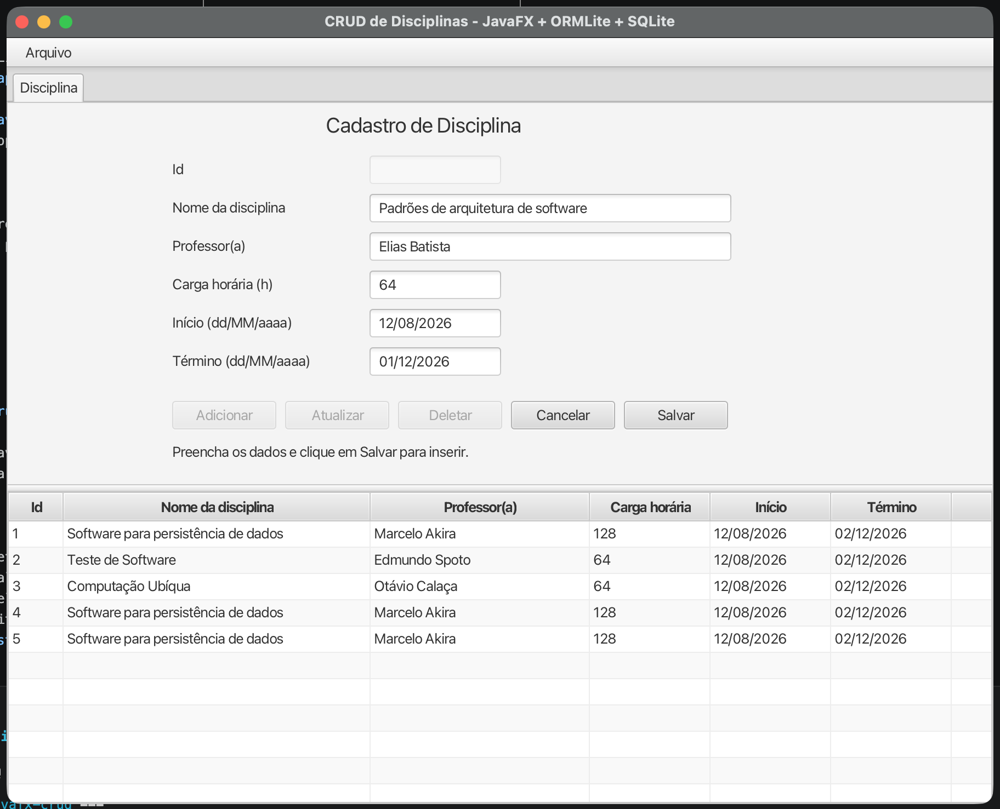
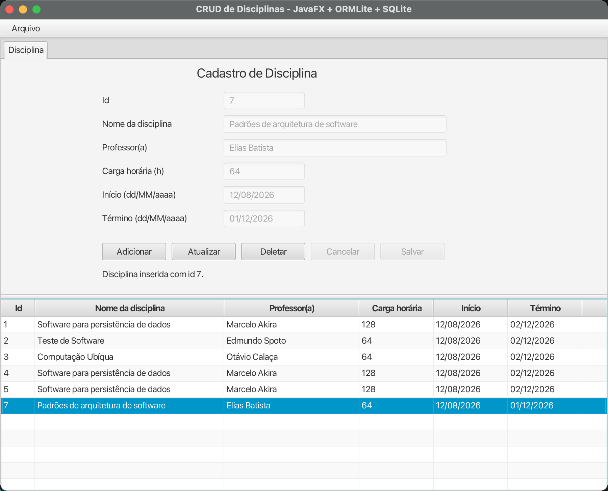
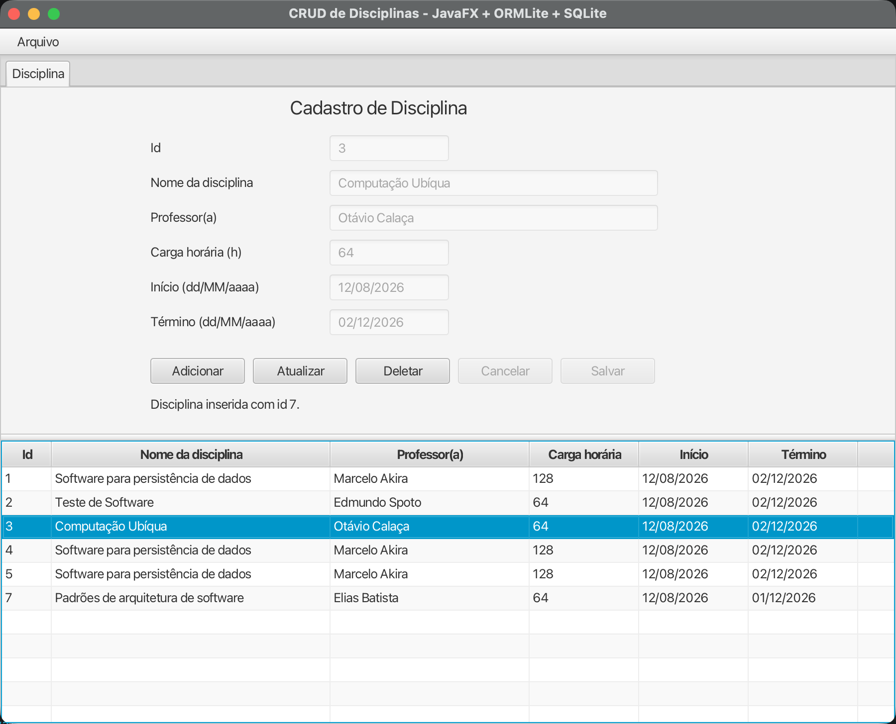
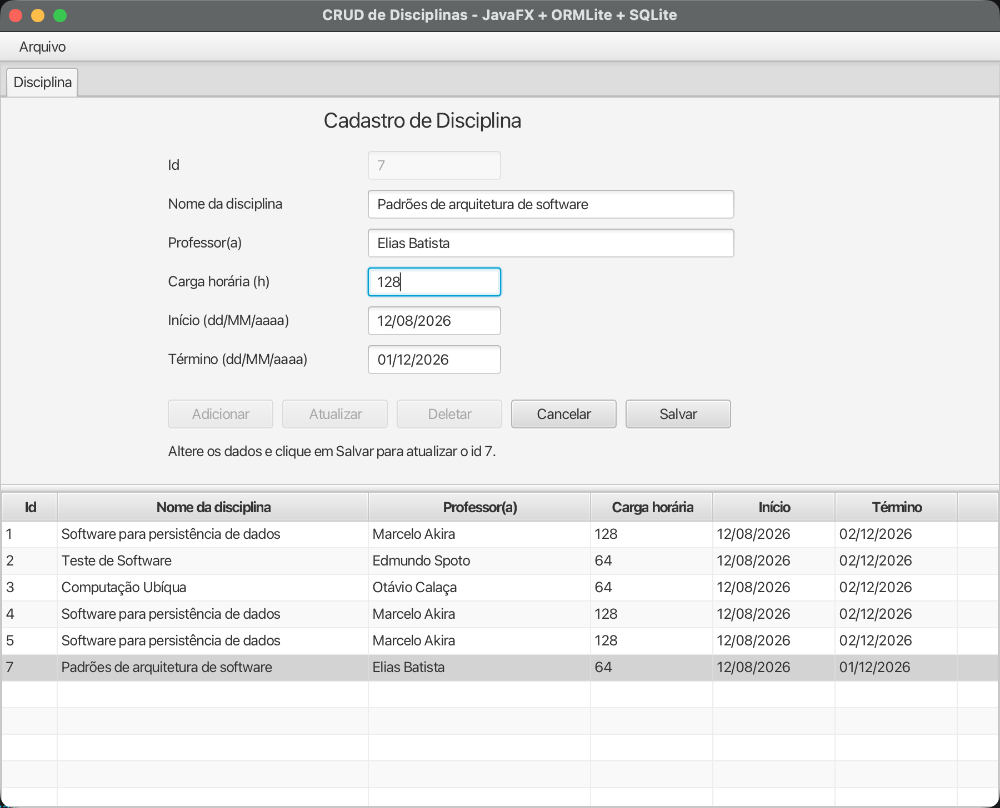
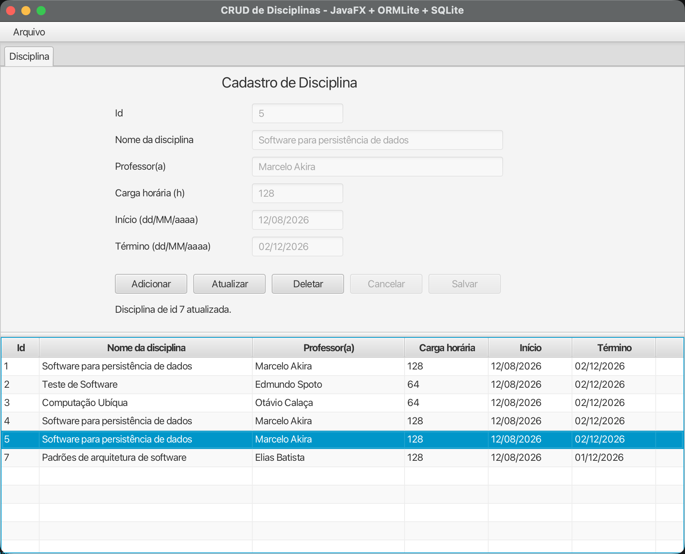
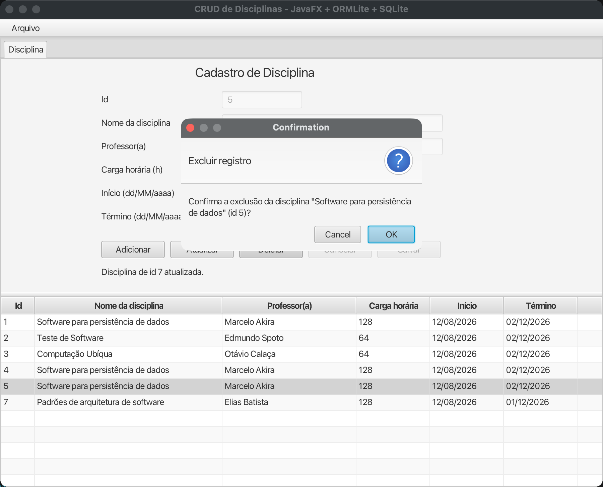
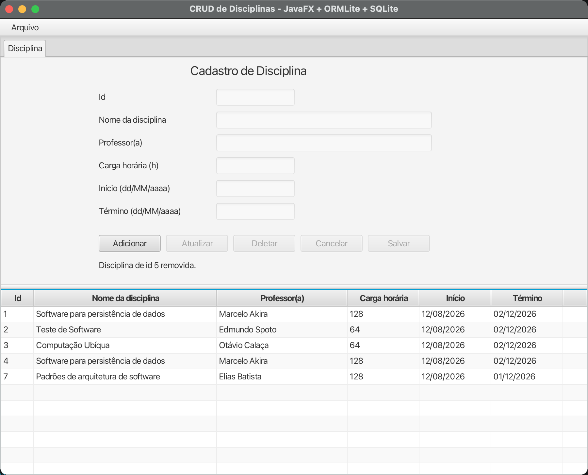

# Atividade 0826 - SPD
Aluno: João Victor L. Faria - 202302614

Considerando a aplicação MVC feita, utilizando Java JX, foi criada uma interface gráfica para permitir a interação, através de controllers, com as entidades de domínio (models) salvas no banco de dados SQL Lite da aplicação.

Considerando isso, seguem os prints das execuções mais relevantes:

### Criação:

Utiliza a action onSalvarButtonAction() do controller AppController para identificar que é criação e chamar a classe de repositório CourseRepository para fazer a persistência da nova entidade.

### Leitura:

Utiliza o método handleCourseSelected(view.Course newSelection) para considerando o Curso que o usuário selecione, exiba este nos campos acima referentes as propriedades da classe de domínio Course.

### Atualização:

Utilizando o mesmo método onSalvarButtonAction(), identifica que está no modo de atualização para realizar as validações e chamar o método da classe de repositório referente a atualização.

### Deleção:

Utilizando o método de controller onDeletarButtonAction(), identifica que o usuário solicitou a deleção de um registro de Course e exibe uma caixa de diálogo de alerta a fim de confirmar com o usuário se ele realmente deseja deletar aquele registro, já que é uma ação irreversível. Ao usuário confirmar a deleção o método de repositório de busca de uma entidade é chamado e posteriormente a deleção dessa mesma entidade é realizada pelo método de repositório equivalente. Após isso a tabela de entidades é carregada novamente, agora sem o registro deletado.

