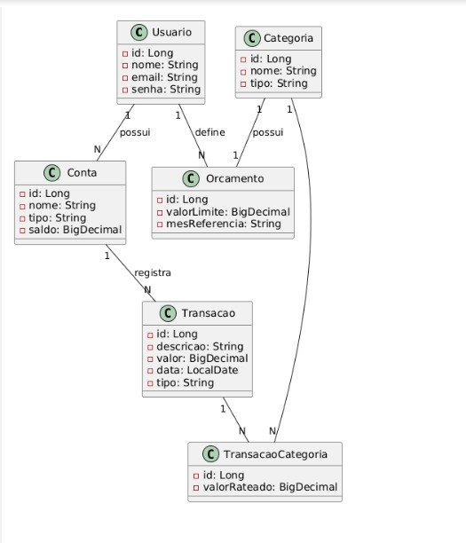
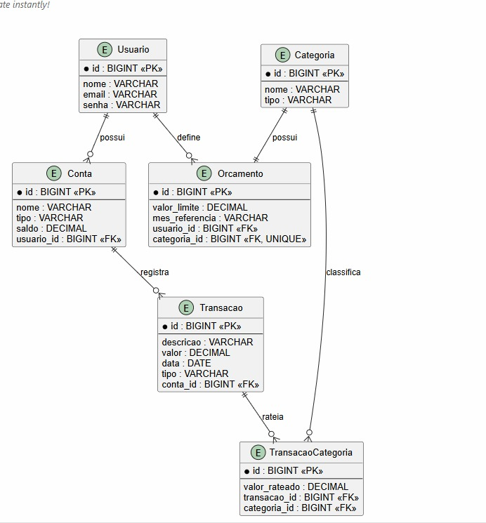

# Controle Financeiro Pessoal — ORM

**Aluno:** João Victor Lemes Faria — 202302614

Camada de persistência em Java com ORMLite e SQLite.

## Diagrama de Classes

## Diagrama E-R

## Entidades

| Entidade | Descrição |
|---|---|
| `Usuario` | dono das contas e dos orçamentos |
| `Conta` | conta corrente, poupança ou carteira de um usuário |
| `Categoria` | classificação de receita ou despesa |
| `Transacao` | lançamento registrado em uma conta |
| `Orcamento` | limite mensal definido para uma categoria |
| `TransacaoCategoria` | classe de associação que classifica uma transação entre categorias |

## Relações

| Cardinalidade | Relação | Mapeamento |
|---|---|---|
| **1:N** | `Usuario` possui `Conta` | FK `usuario_id` em `contas` |
| **1:N** | `Usuario` define `Orcamento` | FK `usuario_id` em `orcamentos` |
| **1:N** | `Conta` registra `Transacao` | FK `conta_id` em `transacoes` |
| **1:1** | `Categoria` possui `Orcamento` | FK `categoria_id` em `orcamentos`, com `UNIQUE` |
| **N:M** | `Transacao` ↔ `Categoria` | tabela associativa `transacao_categorias`, com o atributo `valorRateado` |
