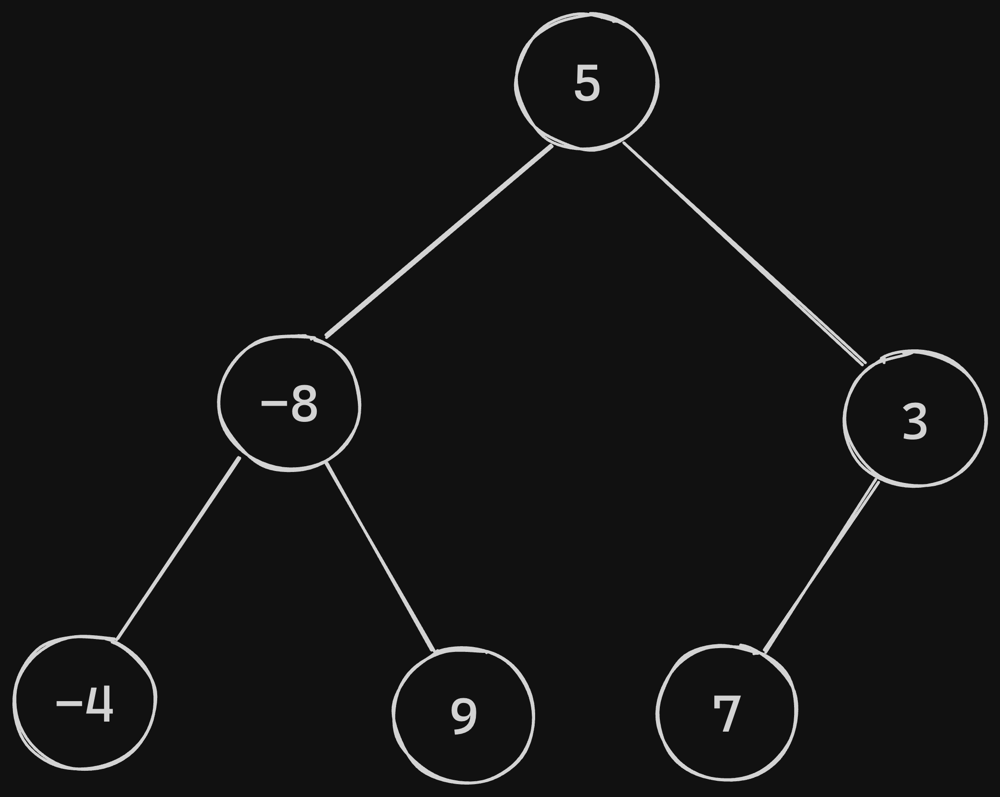
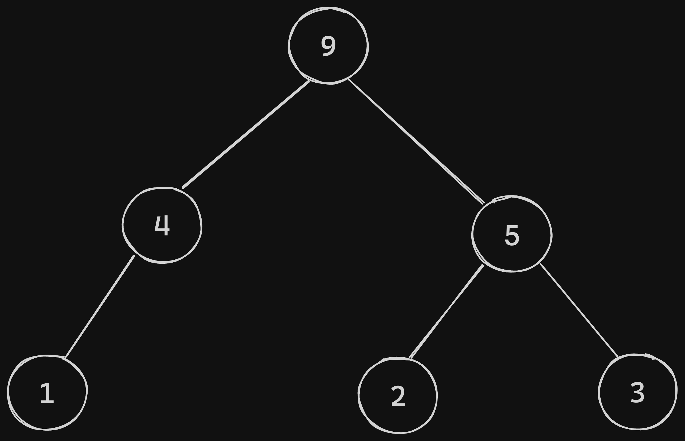
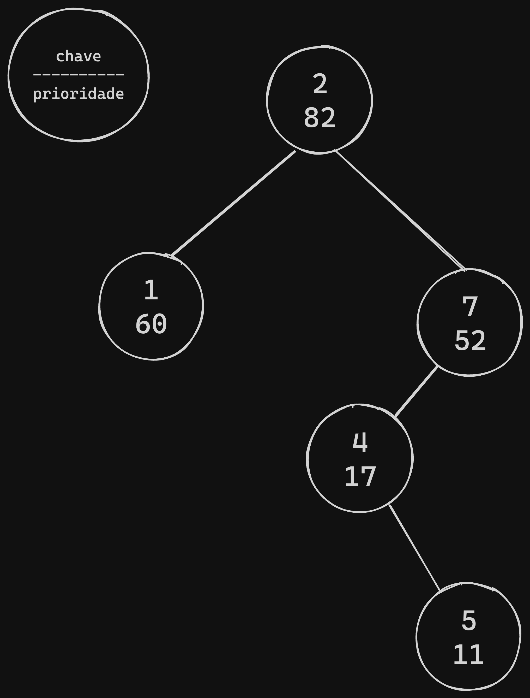

<h1 align=center>Treaps e Randomized Binary Search Trees</h1>

Primeiramente, para compreendermos essas estruturas mais complexas devemos antes entender
outras estruturas que são base para elas, são elas: Árvore binária de busca e heap.

### Arvóre binária de busca

Também conhecida como binary search tree, é uma estrutura de árvore composta
por nós, em que cada um possui no máximo dois filhos e os valores a esquerda
são sempre menores que o nó pai e os valores a direita são sempre maiores que
o nó pai.



### Heap

É uma também uma estrutura em árvore similar a BST, porém o nó pai é sempre
maior que os seus filhos.



## Treaps

- O que são?

Treap é uma estrutura de dados que combina as propriedades de uma árvore
binária de busca com uma estrutura de uma árvore heap.

Dessa maneira na estrutura treap cada nó possui dois valores, um número que
deseja-se inserir que age como chave e outro que é gerado aleatoriamente que age
como prioridade.

>Essa é a estrutura básica de um nó de uma treap
```go
type Node struct {
	key     int
	priority int
	left    *Node
	right   *Node
}
```

Nessa estrutura para inserir um novo node deve-se inserir o elemento como
em uma BST comum tomando como referência a chave e, após inserida, se for necessário,
perfomar rotações para que o valor da prioridade atenda a propriedade da heap de que
o valor do nó pai deve ser maior que o valor do nós filhos.



- Qual o seu objetivo?

Assim, o objetivo dessa combinação entre uma BST, com uma aleatoriedade de heap é fazer com
que a chance de degeneração das operações da árvore em uma complexidade O(n) seja menor, já que a
aleatoriedade em grande escala tende a garantir um bom balanceamento da árvore. 
Assim a complexidade de tempo esperada em uma estrutura Treap para qualquer operação é de
**O(Log n)**.

- Qual o desempenho?

Executando o [código disponível da implementação da treap](http://github.com/lem3s/Estudos/terceiroPeriodo/ED2/atividadeFinalDeArvores/implementacaoTreap.go) temos:

```
# Inserção levou: 13.792µs
# Inserção levou: 375ns
# Inserção levou: 208ns
# Inserção levou: 209ns
# Inserção levou: 292ns
# Inserção levou: 250ns
# Inserção levou: 167ns
Treap em ordem:
(1, 43) (2, 4) (3, 16) (4, 99) (5, 50) (6, 72) (7, 69)
Procurando por chaves:
Chave 2 existe na Treap.
# Busca levou: 1.792µs
Chave 5 existe na Treap.
# Busca levou: 1.625µs
Chave 8 não existe na Treap.
# Busca levou: 1.833µs
Chave deletada 3.
# Deleção levou: 2.583µs
Chave deletada 6.
# Deleção levou: 1.666µs
Treap em ordem após deleção:
(1, 43) (2, 4) (4, 99) (5, 50) (7, 69)
```

Analisando os dados podemos chegar a conclusão que os tempos de execução foram em média aproximadamente:

- Inserção: 250ns
- Busca: 1.75µs
- Deleção: 2µs

## Randomized Binary Search Trees

- O que são?

Esse tipo de árvore consiste em uma árvore binária que as inserções são realizadas em ordem
aleatória.

As treaps podem ser consideradas um tipo de Randomized Binary Search Tree, uma vez que utilizam a aleatoriedade
como um fator para auxiliar o balanceamento.

- Qual o seu objetivo?

O objetivo de utilizar a aleatoriedade é o fato dela ajudar a balancear a árvore sem a necessidade
de métodos complexos de balancemento. Assim o balanceamento probabilísto acaba por diminuir a chance de
degeneração da árvore de uma maneira mais simples e gerando uma árvore com um nível aceitável de
balanceamento.
